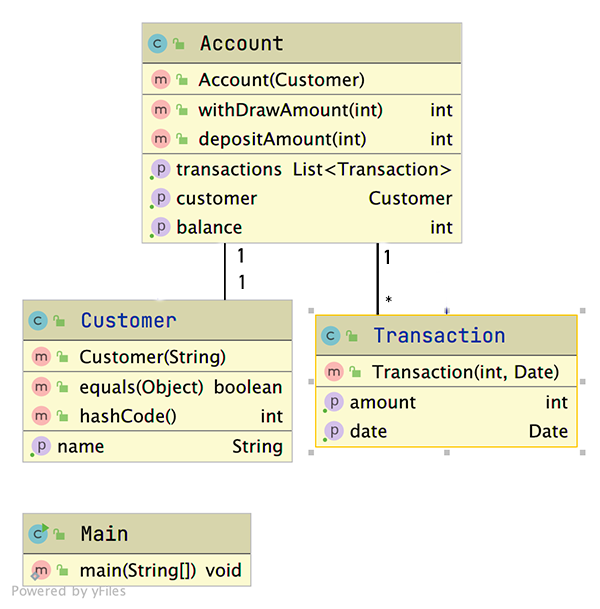

# Bankdemo

### Demokode til 2. semester i forbindelse med jUnit5 opgave

Dette repository er noget vi har overtaget fra en standervissen polak vi mødte et sted i Sydhavnen sidste år. 
Han talte usammenhængende om, at han ikke nåede at blive færdig med koden inden han forsvandt under bordet med en halv flaske [Zubrowka](https://purevodka.dk/shop/zubrowka-vodka/) i den ene hånd.
Vores umiddelbare indtryk er, at han slet ikke har fået lavet unit-tests, og en del af metoderne er heller ikke færdige. Så det er jeres opgave:

1. En fra gruppen skal downloade en zipfil med koden og pakke den ud på sin maskine. 
2. Lav et Git Repository og sørg for at skubbe filerne op på jeres egen GitHub konto.
3. Derefter kan resten af gruppen clone projektet
4. Kig koden godt igennem og dan jer et indtryk af projektets tilstand. Der er noget test-agtigt kode i Main-klassen. Det er selvfølgelig en utjekket måde at teste på.
5. Lav nogle test-klasser for Account, Customer og Transaction og lav tests til alle de metoder I kan.
6. Gør selve metoderne færdige og bliv ved indtil alle jeres tests lyser grønt.
7. I er færdige med første runde, når I har kodet alle metoderne færdige og alle tests lyser grønt.
8. Nu er det op til jer at udvide banken med noget mere funktionalitet. Feks. en metode, som kan udskrive alle transaktioner på en konto etc.

God fornøjelse

Her er et slags klassediagram, som måske kan give lidt overblik:

